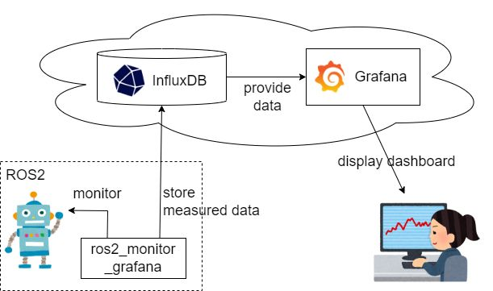

# ROS 2 Monitor with Grafana

## About

- Monitor ROS 2 topic rate
- Store topic rate into InfluxDB
- Display dashboard in Grafana for the created database
- Sample: https://snapshots.raintank.io/dashboard/snapshot/wAcs2K0k7w2R03w9T3BYUsSB5qqVcdSq



## How to use

### 1. Install requirements

```sh
pip3 install influxdb_client
```

- You also need ROS 2

### 2. Prepare InfluxDB

- Create your [InfluxDB Cloud 2.0 account](https://www.influxdata.com/) (You can use your Google account)
  - Find your URL (Host Name) and Organization ID in Organization -> Settings, and generate a new Token in API Tokens
- Or, run a local Docker container as described below

### 3. Prepare Grafana

- Create your [Grafana account](https://grafana.com/) (You can use your Google account)
- Or, run a local Docker container as described below

### 4. Run your ROS 2 application

- You can use my sample application
  - `python3 src/sample_ros_app.py`

### 5. Run ROS 2 Monitor with Grafana

```sh
# Parameters for InfluxDB Cloud 2.0 (example)
token=o3gajXfkeJ8PwOD9QJ5aO6R2WJkk9jn0PqUWak_5ECWrzoJ456WWSxLqibQUhN-89MH9TznPkflVGaMXnFlFxw==
org=yourname@gmail.com
url=https://us-east-1-1.aws.cloud2.influxdata.com
bucket_name=my-bucket

# Parameters for local docker container
token=my-super-secret-auth-token
org=my-org
url=http://localhost:8086
bucket_name=my-bucket

# Start monitoring ROS 2 topics and uploading data
python3 src/main.py --token=$token --org=$org --url=$url --bucket_name=$bucket_name
```

- Please adjust arguments such as token, org, etc. for your account

### 6. Setup Grafana

- Login to Grafana
  - Cloud: https://yourname.grafana.net/
  - Docker: http://localhost:3000  (admin, admin)
- Configure datasource
  - `Configuration` -> `Data sources` -> `Add data source`
  - Select `InfluxDB`, and process the following settings, then click `Save & Test`
    - Default: checked
    - Query Language: Flux
    - URL: http://localhost:8086
    - (User: my-user)
    - (Password: my-password)
    - Organization: my-org
    - Token: my-super-secret-auth-token
    - Default Bucket: my-bucket
    - (Please replace arguments such as url, token, etc. for your account)
- Configure dashboards
  - `Dashboards` -> `Browse` -> `New` -> `Import`
  - `Upload JSON file`
    - Select  `./dashboard/topic_monitor.json`
    - Click `Import`

## (optional) Docker containers

### InfluxDB

```sh
mkdir temp && cd temp
mkdir ./influxdb
mkdir ./influxdb/config
mkdir ./influxdb/data

docker run --rm -d \
  --net host \
  -v $PWD/influxdb/data:/var/lib/influxdb2 \
  -v $PWD/influxdb/config:/etc/influxdb2 \
  -e DOCKER_INFLUXDB_INIT_MODE=setup \
  -e DOCKER_INFLUXDB_INIT_USERNAME=my-user \
  -e DOCKER_INFLUXDB_INIT_PASSWORD=my-password \
  -e DOCKER_INFLUXDB_INIT_ORG=my-org \
  -e DOCKER_INFLUXDB_INIT_BUCKET=my-bucket \
  -e DOCKER_INFLUXDB_INIT_RETENTION=1w \
  -e DOCKER_INFLUXDB_INIT_ADMIN_TOKEN=my-super-secret-auth-token \
  influxdb:2.4.0
```

- Access http://localhost:8086/signin to explorer your database
  - Username: my-user
  - Password: my-password

- Query to explorer data

```
from(bucket: "my-bucket")
  |> range(start: 0, stop: 1d)
  |> filter(fn: (r) => r["_measurement"] == "ros2_topic")
  |> filter(fn: (r) => r["_field"] == "topic_rate_hz")
//   |> filter(fn: (r) => r["topic_name"] == "/topic_1000_ms")
```

### Grafana

```sh
mkdir ./grafana

docker run --rm -d \
  --net host \
  --user `id -u` \
  -v $PWD/grafana:/var/lib/grafana \
  grafana/grafana
```

- Access http://localhost:3000/ to show your dashboards
  - Username: admin
  - Password: admin


### ROS 2

```sh
docker run -it --rm \
  --net host \
  -v $PWD:/work \
  -v /etc/localtime:/etc/localtime:ro \
  osrf/ros:humble-desktop bash
```

## Notice

- `./src/hz.py` is retrieved from https://raw.githubusercontent.com/ros2/ros2cli/humble/ros2topic/ros2topic/verb/hz.py and modified.
