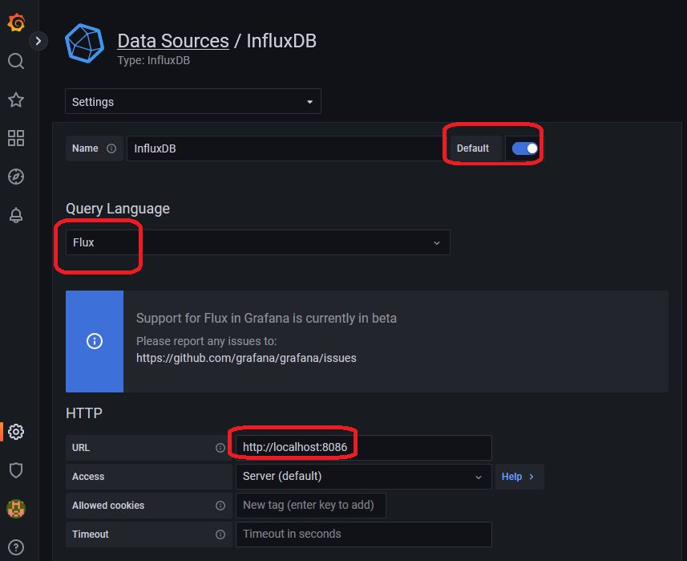
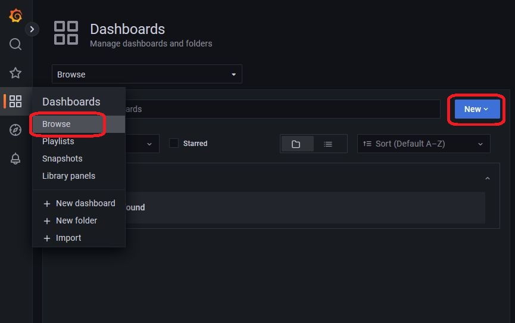
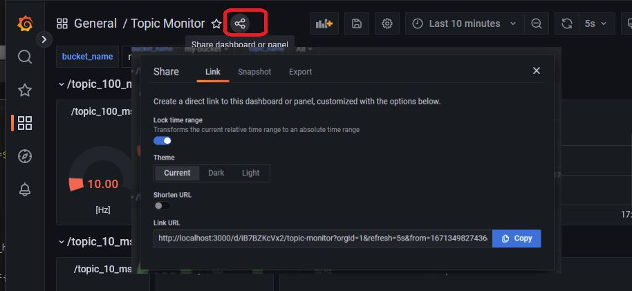

GrafanaでROS2トピック監視用ダッシュボードを作る

# 本記事について

- 背景
    - ROSアプリケーションを開発/運用していると、各トピックが所定の周期でちゃんと動いているかを確認したいことがあります
    - トピック周期が遅くなっていると、センサー入力が途絶えていたり、途中のノードの処理が遅れているという問題に気付くことが出来ます
    - 監視したいトピックが決まっていたり、小数の場合には `ros2 topic hz topic_name` で確認ができます
- 本記事で作るもの
    - 本記事では、対象ROSアプリケーションで使われている全トピックの状態をリアルタイムで監視するためのダッシュボードを作っていきます
    - 下図のように各トピックの周期を、リアルタイムの最新値 / ヒストグラム / 時系列で表示します
    - ダッシュボード表示にはGrafanaを使います。ローカルでGrafana環境を用意することもできますが、Grafana Cloudを使うことで、他メンバーにシェアすることも出来ます
- 実際のダッシュボード (snapshot) はこちらから表示することができます
    - https://snapshots.raintank.io/dashboard/snapshot/wAcs2K0k7w2R03w9T3BYUsSB5qqVcdSq


## 概要

- ソースコードはこちらになります: https://github.com/iwatake2222/ros2_monitor_grafana
- 対象ROSアプリケーションのトピックを常時計測します
- 計測した結果を、データベース (InfluxDB) に書き込みます
- データベース内のデータをGrafanaで可視化します


# 導入手順

## 1. ROS2、監視環境の準備

- 対象はROS2アプリケーションなので、当然ROS2がインストールされている必要があります。今回はHumbleで確認をしました。
- データベースとしてInfluxDBを使います。PythonからInfluxDBを操作するために、`influxdb_client` というライブラリをインストールします

```sh
# (optional) ROS2
docker run -it --rm \
  --net host \
  -v $PWD:/work \
  -v /etc/localtime:/etc/localtime:ro \
  osrf/ros:humble-desktop bash

# Install requirements
pip3 install influxdb_client
```

## 2. InfluxDBの準備

- 計測結果を蓄積するために、InfluxDBを使います。InfluxDBは時系列データに強いデータベースです

### クラウドの場合

- InfluxDBは、[InfluxDB Cloud 2.0](https://www.influxdata.com/)というクラウドサービスを提供しています
    - 専用のアカウント作成は不要で、Google Accountからログインできます
- ログイン後、`Settings` 画面から以下の情報を確認しメモしておきます
    - URL (Host Name)
    - Organization ID
- また、`API Tokens` 画面から新規Tokenを生成し、Tokenをメモしておきます


### ローカルでDocker Containerを立ち上げる場合

- 提供されているDocker imageを用いて、ローカルで動かすこともできます
- ログイン先は下記のとおりです
    - http://localhost:8086/signin
    - Username: my-user
    - Password: my-password
- 各種アクセス情報は環境変数にべた書きしています。必要に応じて書き換えてください

```sh
mkdir temp && cd temp
mkdir ./influxdb
mkdir ./influxdb/config
mkdir ./influxdb/data

docker run --rm -d \
  --net host \
  -v $PWD/influxdb/data:/var/lib/influxdb2 \
  -v $PWD/influxdb/config:/etc/influxdb2 \
  -e DOCKER_INFLUXDB_INIT_MODE=setup \
  -e DOCKER_INFLUXDB_INIT_USERNAME=my-user \
  -e DOCKER_INFLUXDB_INIT_PASSWORD=my-password \
  -e DOCKER_INFLUXDB_INIT_ORG=my-org \
  -e DOCKER_INFLUXDB_INIT_BUCKET=my-bucket \
  -e DOCKER_INFLUXDB_INIT_RETENTION=1w \
  -e DOCKER_INFLUXDB_INIT_ADMIN_TOKEN=my-super-secret-auth-token \
  influxdb:2.4.0
```

## 3. Grafanaの準備

### クラウドの場合

- Grafanaは、[Grafana Cloud](https://grafana.com/)というクラウドサービスを提供しています
    - 専用のアカウント作成は不要で、Google Accountからログインできます
- ログイン後、`My Account` -> `Grafana` -> `Launch` でGrafanaのメイン画面に入れます
    - URLは https://your_id.grafana.net/a/cloud-home-app になります

### ローカルでDocker Containerを立ち上げる場合

- 提供されているDocker imageを用いて、ローカルで動かすこともできます
- ログイン先は下記のとおりです
    - http://localhost:3000/
    - Username: admin
    - Password: admin

```sh
mkdir ./grafana

docker run --rm -d \
  --net host \
  --user `id -u` \
  -v $PWD/grafana:/var/lib/grafana \
  grafana/grafana
```

## 4. 対象アプリケーションを起動する

- 監視したいROSアプリケーションを起動します
- 適当に試したい場合は、以下のサンプルアプリケーションを起動してください
    - 10 Hz、50 Hz、100 Hz、500 Hzの4つのトピックに対してTalker/Listenerが作られます

```sh
git clone https://github.com/iwatake2222/ros2_monitor_grafana
cd ros2_monitor_grafana
python3 src/sample_ros_app.py
```

## 5. 監視スクリプトを起動する

- ROSトピックを取得して、計測結果を随時InfluxDBに書き込むスクリプトを起動します
- InfluxDBにアクセスするため、自分の環境に合わせて `token` 、`org` 、`url` を設定する必要があります
    - クラウド版InfluxDBを使っている場合は、自分の情報に合わせて置き換えてください
    - 上述のコマンドそのままでDockerコンテナを起動している場合は、下記のままで大丈夫です

```sh
# Parameters for InfluxDB Cloud 2.0 (example)
token=o3gajXfkeJ8PwOD9QJ5aO6R2WJkk9jn0PqUWak_5ECWrzoJ456WWSxLqibQUhN-89MH9TznPkflVGaMXnFlFxw==
org=yourname@gmail.com
url=https://us-east-1-1.aws.cloud2.influxdata.com
bucket_name=my-bucket

# Parameters for local docker container
token=my-super-secret-auth-token
org=my-org
url=http://localhost:8086
bucket_name=my-bucket

# Start monitoring ROS 2 topics and uploading data
python3 src/main.py --token=$token --org=$org --url=$url --bucket_name=$bucket_name
```

- 本スクリプトを起動すると、データベース (InfluxDB) が随時更新されているはずなので、それをInfluxDB上で確認しておきます
    - InfluxDB自体もデータを確認したり簡単な可視化機能を持っています
    - InfluxDBにログインし、`Data Explorer` -> `SCRIPT EDITOR` -> 下記スクリプトを貼り付け -> `SUBMIT` します
    - データが追加されていればOKです
        - グラフだと正しく表示されないことがあるので、 `View Raw Data` にチェックをつけてテーブル表示にした方がよいです
        - `QUERY BUILDER`だと望むように表示してくれないことが多いのでクエリー文を書いた方が間違いないです (特に時間指定にはまりやすい！)

    ```
    from(bucket: "my-bucket")
    |> range(start: 0, stop: 1d)
    |> filter(fn: (r) => r["_measurement"] == "ros2_topic")
    |> filter(fn: (r) => r["_field"] == "topic_rate_hz")
    //   |> filter(fn: (r) => r["topic_name"] == "/topic_1000_ms")
    ```


## 6. Grafana上でダッシュボードを作る

- ここまでで、InfluxDB上にデータを蓄積することができました。最後にいよいよ、Grafana上で可視化します

### Data sourceの設定

- まずは、Grafanaが先ほど作成したInfluxDBのデータにアクセスできるように設定します
- Grafanaにログインし、左下の `Configuration` -> `Data sources` -> `Add data source` -> `InfluxDB` を選択します
- 以下のように設定し、最後に `Save & Test `をクリックし接続を確認してください
    - Default: checked
    - Query Language: Flux
    - URL: http://localhost:8086
    - (User: my-user)
    - (Password: my-password)
    - Organization: my-org
    - Token: my-super-secret-auth-token
    - Default Bucket: my-bucket
    - (本設定は本記事記載の内容でDocker containerを起動した場合です。必要に応じて変更してください)





### ダッシュボードの作成

- 画面左側の `Dashboards` -> `Browse` 画面を開き、`New` -> `Import` をクリックします
- `Upload JSON file` をクリックし、`dashboard/topic_monitor.json` を選択し、Importします
- すると、本記事冒頭のようなダッシュボード画面が表示されるはずです
    - 表示されない場合は、画面を更新したり、画面左上のbucket_nameやtopic_nameのプルダウンを変更したり、画面右上の時刻の範囲を変更したりしてみてください




# その他

## 計測対象トピックについて

- トピック状態を取得するに、 `ros2 topic` のソースコードである、 [hz.py](https://raw.githubusercontent.com/ros2/ros2cli/humble/ros2topic/ros2topic/verb/hz.py) を変更したものを使っています
    - hz.pyはCLI用ですが、自分のスクリプトから呼び出しやすいように変更し、さらに複数トピックを同時に監視できるように変更しました
    - 対象トピック数が多くなると、計測が間に合わなくなり、計測結果が徐々に小さくなってしまいます
        - だいたい50程度から結果が怪しくなってきました
    - `python3 src/main.py` を実行する際に以下のオプションで対象トピックを絞ることができます
        - `--ignore_regexp` : 計測対象外とするトピック名 (正規表現)
        - `--target_regexp` : 計測対象とするトピック名 (正規表現)

## ダッシュボードの共有について



- 作成したダッシュボードは他の人に共有することができます
    - Linkを共有した場合は、閲覧者もGrafanaにログインする必要があります
    - Snapshotを共有した場合は、ログイン不要ですがリアルタイムの結果を見ることはできません
- 共有機能によって、例えばスマホからでもトピック監視結果を確認することができます


